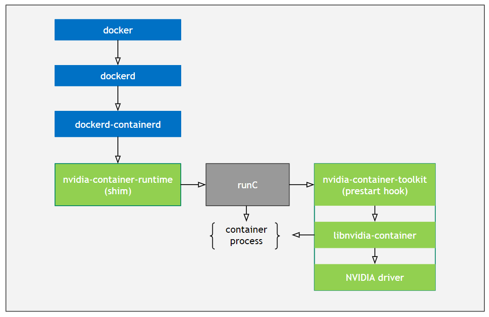

## GPU-Operator
GPU-Operator的作用是能够在k8s的环境中使用gpu，将对应的gpu分配到指定的容器中。

### 组件

NVIDIA Device Plugin给节点打上nvidia.com/gpu.present=true标签之后，才能开始后续行为。其中NFD都是发现Node上的信息，并以label的形式添加到K8s节点中，Driver Installer安装对应GPU的驱动，Container Toolkit Installer安装container toolkit（这个组件很重要），device-plugin 让 k8s 能感知到 GPU 资源信息便于调度和管理，exporter 则是采集 GPU 监控并以 Prometheus Metrics 格式暴露，用于做 GPU 监控。

#### NFD（Node Feature Discovery）
用于给节点打上某些标签，这些标签包括cpu id、内核版本、操作系统版本、是不是GPU节点等。如果打上nvidia.com/gpu.present=true，则说明该节点是GPU节点。

#### NVIDIA Driver Installer
基于容器的方式在节点上安装NVIDIA GPU驱动，在k8s集群中以DaemonSet方式部署，只有节点拥有标签nvidia.com/gpu.present=true时，DaemonSet控制的Pod才会在该节点上运行

#### NVIDIA Container Toolkit Installer
能够实现在容器中使用GPU设备，在k8s集群中以DaemonSet方式部署，只有节点拥有标签nvidia.com/gpu.present=true时，DaemonSet控制的Pod才会在该节点上运行

NVIDIA Container Toolkit的作用

1. 安装NVIDIA Container Toolkit
2. 修改Runtime 配置指定使用 nvidia-runtime（在创建gpu的pod时，增加一些配置和处理）

- NVIDIA Container Toolkit
    - nvidia-container-toolkit是一个实现了runC prestart hook接口的脚本，该脚本在runC
    创建一个容器之后，启动该容器之前调用，其主要作用就是修改与容器相关联的config.json，注入一些在容器中使用NVIDIA GPU设备所需要的一些信息（比如：需要挂载哪些GPU设备到容器当中）。
- nvidia-container-runtime
    - nvidia-container-runtime主要用于将容器runC spec作为输入，然后将nvidia container-toolkit脚本作为一个prestart hook注入到runC spec中，将修改后的runC spec交给runC处理。
    - nvidia-container-runtime 才是真正的核心部分，它在原有的docker容器运行时runc的基础上增加一个prestart hook，用于调用libnvidia-container库。
    - nvidia-container-runtime其实就是在runc基础上多实现了nvidia-container-runime hook，该hook是在容器启动后（Namespace已创建完成），容器自定义命令(Entrypoint)启动前执行。当检测到NVIDIA_VISIBLE_DEVICES环境变量时，会调用libnvidia-container挂载GPU Device和CUDA Driver。如果没有检测到NVIDIA_VISIBLE_DEVICES就会执行默认的runc。
- RunC
    - RunC 是一个轻量级的工具，它是用来运行容器的，只用来做这一件事，并且这一件事要做好。我们可以认为它就是个命令行小工具，可以不用通过 docker 引擎，直接运行容器。事实上，runC 是标准化的产物，它根据 OCI 标准来创建和运行容器。而 OCI(Open Container Initiative)组织，旨在围绕容器格式和运行时制定一个开放的工业化标准。直接使用RunC的命令行即可以完成创建一个容器，并提供了简单的交互能力。

#### NVIDIA Device Plugin
NVIDIA Device Plugin用于将GPU设备以K8s扩展插件资源的方式供用户使用，同时给节点打上nvidia.com/gpu.present=true标签。在k8s集群中以DaemonSet方式部署，只有节点拥有标签nvidia.com/gpu.present=true时，DaemonSet控制的Pod才会在该节点上运行

NVIDIA Device Plugin与kubelet交互图
.png)

##### 总结
1. device plugin端启动自己服务, 地址为(/var/lib/kubelet/device-plugins/kubelet.sock).
2. device plugin向地址为(/var/lib/kubelet/device-plugins/kubelet.sock)发送注册请求(含有
resoucename以及自己服务的地址/var/lib/kubelet/device-plugins/sock.sock).
3. device manager收到请求分配一个新的endpoint与该device plugin通过device plugin的
ListAndWatch进行连接并通信.
4. 当device plugin的ListAndWatch有变化时, 对应的endpoint会感知并通过回调函数告知
device manager需要更新它的资源以及对应设备信息(healthyDevices和unhealthyDevices)
5. GPU Device plugin 部署到GPU节点上，通过 ListAndWatch  接口，  上报注册节点的GPU信
息和对应的DeviceID。
6. 当有声明 nvidia.com/gpu  的GPU Pod创建出现，调度器会综合考虑GPU设备的空闲情况，   
将Pod调度到有充足GPU设备的节点上。
7. 节点上的kubelet 启动Pod时，根据request中的声明调用各个Device plugin 的allocate接
口， 由于容器声明了GPU。kubelet 根据之前 ListAndWatch 接口收到的Device信息，选取
合适的设备，DeviceID 作为参数，调用GPU DevicePlugin的 Allocate 接口。Nvidia GPU 
device plugin做的事情，就是根据kubelet 请求中的GPU DeviceId， 转换为 
NVIDIA_VISIBLE_DEVICES 环境变量返回给kubelet
8. GPU Device Plugin ，接收到调用，将DeviceID 转换为 NVIDIA_VISIBLE_DEVICES  环境变
量，返回给kubelet
9. kubelet收到返回内容后，会自动将返回的环境变量注入到容器中。启动容器
10. 容器启动时， gpu-container-runtime 调用 gpu-containers-runtime-hook 。Nvidia的 gpu
container-runtime根据容器的 NVIDIA_VISIBLE_DEVICES 环境变量，会决定这个容器是否为
GPU容器，并且可以使用哪些GPU设备。如果没有携带NVIDIA_VISIBLE_DEVICES这个环境变
量，那么就会按照普通的docker启动方式来启动
11. gpu-containers-runtime-hook根据容器的 NVIDIA_VISIBLE_DEVICES 环境变量，转换为 -
devices 参数，调用 nvidia-container-cli prestart，nvidia-container-cli 。根据 --devices ，
将GPU设备映射到容器中。并且将宿主机的Nvidia Driver Lib 的so文件也映射到容器中。 此
时容器可以通过这些so文件，调用宿主机的Nvidia Driver。

#### DCGM Exporter
周期性的收集节点GPU设备状态（当前温度、总显存、以使用显存、使用率等），并暴露Metrics，结合Prometheus和Grafana使用。只有节点拥有标签nvidia.com/gpu.present=true时，DaemonSet控制的Pod才会在该节点上运行

### 创建一个使用gpu的容器
docker–> dockerd --> containerd --> containerd-shim–> nvidia-container-runtime -
> nvidia-container-runtime-hook --> libnvidia-container --> runc – > container
process

### 整体流程
1. device plugin上报节点上的gpu信息
2. 用户创建pod，在resources.request中申请GPU，Scheduler根据各节点GPU资源情况，将pod调度到一个有足够GPU的节点
3. Device plugin根据pod中申请的GPU资源，为容器添加NVIDIA_VISIBLE_DEVICES环境变量（例如：NVIDIA_VISIBLE_DEVICES=GPU-03f69c50-207a-2038-9b45-23cac89cb67d）
4. docker / containerd 启动容器
   1. 由于配置了 nvidia-container-runtime,因此会使用 nvidia-container-runtime 来创建容器
   2. nvidia-container-runtime 额外做了一件事：将 nvidia-container-runtime-hook 作为 prestart hook 添加到容器 spec 中，然后就将容器 spec 信息往后传给 runC 了。
   3. runC 创建容器前会调用 prestart hook，其中就包括了上一步添加的 nvidia-container-runtime-hook，该 hook 主要做两件事：
      1. 从容器 Spec 的 mounts 或者 env 中解析 GPU 信息
      2. 调用 nvidia-container-cli 命令，将 NVIDIA 的 GPU Driver、CUDA Driver 等库文件挂载进容器，保证容器内可以使用被指定的 GPU以及对应能力
核心就是两个部分：
1. device plugin 根据 GPU 资源申请为容器添加 NVIDIA_VISIBLE_DEVICES环境变量
2. nvidia-container-toolkit 则是根据 NVIDIA_VISIBLE_DEVICES环境变量将 GPU、驱动等相关文件挂载到容器里

### 为什么 Pod 明明没有申请 GPU，启动后也能看到所有 GPU？
这是因为 nvidia-container-toolkit 中存在特殊逻辑，没有设置 NVIDIA_VISIBLE_DEVICES环境变量，也没通过其他方式解析到 device 并且还是一个 legacy image，那么默认会返回all，即：NVIDIA_VISIBLE_DEVICES=all ，因此该 Pod 能看到全部 GPU

https://www.cnblogs.com/KubeExplorer/p/18624112