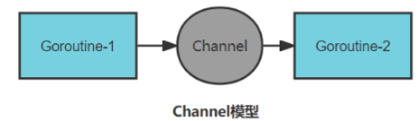
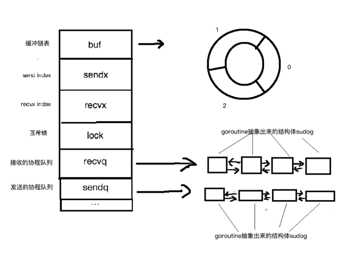
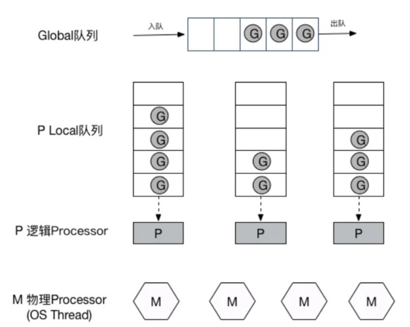
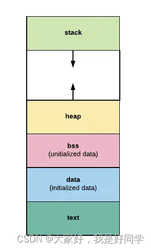
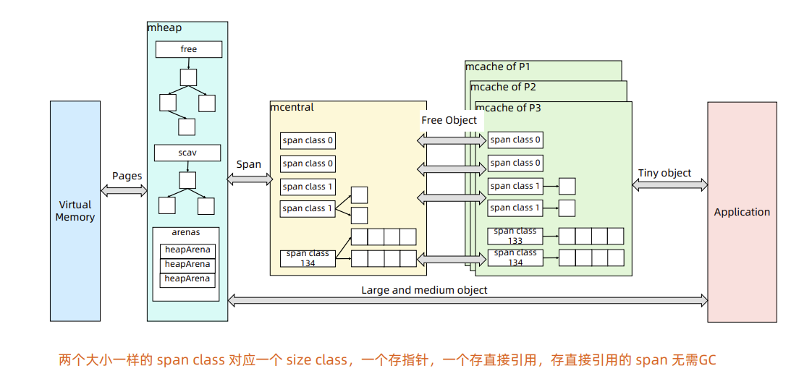
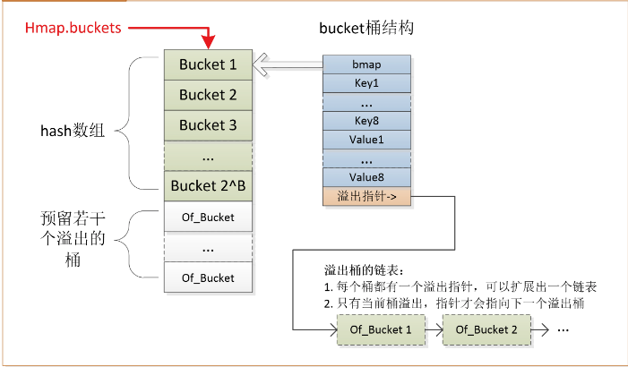

## Go

1. Go里有哪些数据结构是并发安全的？int类型是并发安全的吗？
```go
Go中数据类型分为两大类：
基本数据类型：字节型、整型、布尔型、浮点型、复数型、字符串
复合数据类型：数组、切片、指针、结构体、字典、通道、函数、接口

字节型、布尔型、整型、浮点型取决于操作系统指令值，在64位的指令集架构中可以由一条机器指令完
成，不存在被细分为更小的操作单位，所以这些类型的并发赋值是安全的，但是这个也跟操作系统的位
数有关，比如int64在32位操作系统中，它的高32位和低32位是分开赋值的，此时是非并发安全的。

复和类型、字符串、结构体、数组，切片，字典，通道，接口， 这些底层都是struct，不同成员的赋值
都不是一起的，所以都不是并发安全的。
```

2. string 是线程安全的吗？
```go
string 并不是并发安全的

安全访问方式：
1、使用互斥锁（sync.Mutex）
2、使用atomic包（能够保证string 类型变量的原子操作，但在现实场景下，仍然无法解决多 goroutine 导致的竞态条件）

string与[]byte之间的切换：需要新的内存分配 或者 从结构体入手进行替换

type stringStruct struct {
    str unsafe.Pointer
    len int
}

type slice struct {
	array unsafe.Pointer
	len   int
	cap   int
}
```
3. Go如何实现一个单例模式？
```go
type singleton struct {
 
}
懒汉式
var instance *singleton
var once sync.Once
func GetInstance() *singleton {
 once.Do(func() {
  instance = new(singleton)
 })
 return instance
}

饿汉式
var (
	lazySingleton *Singleton
	once          = &sync.Once{}
)

// GetLazyInstance 懒汉式
func GetLazyInstance() *Singleton {
	if lazySingleton == nil {
		once.Do(func() {
			lazySingleton = &Singleton{}
		})
	}
	return lazySingleton
}
```

4. sync.Once是如何实现的，如何不使用sync.Once实现单例模式？
```go
type Once struct {
   done uint32 // done 表明了动作是否已经执行
   m    Mutex  // 锁
}
func (o *Once) Do(f func()) {
    if atomic.LoadUint32(&o.done) == 0 {
      o.doSlow(f)
   }
}

func (o *Once) doSlow(f func()) {
   o.m.Lock()
   defer o.m.Unlock()
   if o.done == 0 {
      defer atomic.StoreUint32(&o.done, 1)
      f()
   }
}

1、atomic.LoadUint32 用于原子加载地址（也就是 &o.done），返回加载到的值；
2、o.done 为 0 是代表尚未执行。若同时有两个 goroutine 进来，发现 o.done 为 0（此时 f 尚未执行），就会进入 o.doSlow(f) 的慢路径中（slow path）
3、doSlow 使用 sync.Mutex 来加锁，一个协程进去，其他的被阻塞在锁的地方（注意，此时是阻塞，不是直接返回，这是和 CAS 方案最大的差别）
4、经过 o.m.Lock() 获取到锁以后，如果此时 o.done 还是 0，意味着依然没有被执行，此时就可以放心的调用 f来执行了。否则，说明当前协程在被阻塞的过程中，已经失去了调用f 的机会，直接返回。
5、defer atomic.StoreUint32(&o.done, 1) 是这里的精华，必须等到f() 返回，在 defer 里才能够去更新 o.done 的值为 1。

避坑：
1、不要拷贝一个 sync.Once 使用或作为参数传递，然后去执行 Do，值传递时 done 会归0，无法起到限制一次的效果。
2、不要在 Do 的 f 中嵌套调用 Do。（遭成死锁）
```

​5. init函数
```go
init函数 递归的加载每个pkg1，然后初始化常量，全局变量，Init函数
```

6. new和make的区别

```go
new(T)会为类型T分配已置0的内存空间，并返回其地址
make(T)用于创建slice，map，channl，并返回类型为T的一个已初始化的值
```

7. 切片

```go
type slice struct{
	array unsafe.Pointer   //指针，指向底层是数组
	len int  //长度，即当前slice可以访问的范围
	cap int  //容量，当前slice可访问底层的最大范围
}
slice :=make([]int, length, capacity)
var slice []int

多个slice之间可以共享底层数据

扩容：当所需容量cap没有大于原先容量cap的2倍，且原切片长度len小于1024时，最终申请容量cap为原先容量2倍。当所需容量cap大于原来容量cap的2倍，则最终申请cap容量为当前所需容量。当原长度大于1024时，基准为1.25倍，不断相乘知道结果不小于原切片长度和追加元素之和。
	
缩容：slice缩容之后还是会引用底层的原数组，有时候会造成大量缩容之后的多余内容没有被垃圾回收，此时可以使用新建一个数组，然后copy
```

8. channel




```go
特性：
	通道类型的值本身是并发安全的，这是go语言自带的，唯一一个可以满足并发安全性的类型
	通道分为非缓冲通道/缓冲通道(容量=0/容量>0)。
	通道相当于一个先进先出的环形链表队列。通道中的各个元素值都是严格按照发送的顺序排列的，先被发送通道的元素值一定会先被接受。
	对于同一个通道，发送操作之间是互斥的，接受操作之间也是互斥。即同一时刻，只会执行对同一个通道的任意个发送操作中的某一个，直到这个元素值被完全复制进该通道之后，其他针对该通道的发送操作才可能被执行。
	发送操作和接受操作中对元素值的处理具有原子性。
	发送操作和接受操作在完全完成之前会被阻塞。
	无缓冲通道相当于同步操作，缓冲通道是异步操作。

panic情况：
	通道一旦关闭，再对该通道进行发送操作，就会 引发panic。
	试图关闭一个已经关闭了的通道。
	chan阻塞在main携程张，并且没有其他子协程可以执行，会死锁

通道一般由发送方关闭。
```

9. Goroutine



```go
G：表示 Goroutine，每个 Goroutine 对应一个 G 结构体，G 存储 Goroutine 的运行堆栈、状态以及任务函数，可重用。G 并非执行体，每个 G 需要绑定到 P 才能被调度执行。

P: Processor，表示逻辑处理器， 对 G 来说，P 相当于 CPU 核，G 只有绑定到 P(在 P 的 local runq 中)才能被调度。对 M 来说，P 提供了相关的执行环境(Context)，如内存分配状态(mcache)，任务队列(G)等，P 的数量决定了系统内最大可并行的 G 的数量。P的数量由用户设置的GOMAXPROCS决定，但是不论GOMAXPROCS设置为多大，P的数量最大为256。

M: Machine，OS 线程抽象，代表着真正执行计算的资源，在绑定有效的 P 后，进入 schedule 循环；而 schedule 循环的机制大致是从 Global 队列、P 的 Local 队列以及 wait 队列中获取 G，切换到 G 的执行栈上并执行 G 的函数，调用goexit做清理工作并回到M，如此反复。M并不保留G状态，这是G可以跨M调度的基础，M的数量是不定的，由Go Runtime调整，为了防止创建过多OS线程导致系统调度不过来，目前默认最大限制为10000个。

当通过go关键字创建一个新的goroutine的时候，它会优先被放入P的本地队列。为了运行goroutine，M需要持有（绑定）一个P，接着M会启动一个OS线程，循环从P的本地队列里取出一个goroutine并执行。还有work-stealing调度算法：当M执行完了当前P的Local队列里的所有G后，P也不会就这么在那躺尸啥都不干，它会先尝试从Global队列寻找G来执行，如果Global队列为空，它会随机挑选另外一个P，从它的队列里中拿走一半的G到自己的队列中执行。

协程拥有自己的寄存器上下文和栈。协程调度切换时，将寄存器上下文和栈保存到其他地方，在切回来的时候，恢复先前保存的寄存器上下文和栈

Goroutine调度策略
	1、每个p有个局部队列，局部队列保存待运行的goroutine，当M绑定的P的局部队列已经满了之后就会把一半的goroutine放到全局队列
	2、每个p和一个M绑定，M是真正的执行P中goroutine的实体，M从绑定的P中的局部队列获取G执行。
	3、当M绑定的P的局部队列为空时，M会从其他P的局部队列中偷取G来执行，这种从其他P偷的方式成为work stealing，然后M会从全局队列获取到本地队列来执行G
	4、当G因系统调用阻塞时会阻塞M，此时P会和M解绑即hand off，并寻找新的idle的M，若没有idle的M就会新建一个M。
	5、当G因channel或network I/O阻塞时，不会阻塞M，M会寻找其他runnable的G；当阻塞的G恢复后会重新进入runnable进入P队列等待执行。

work stealing机制
	获取p本地队列，当从绑定p本地runq上找不到可执行的g，尝试从全局链表中拿，再拿不到从netpoll和事件池拿，最后会从别的P中偷任务。p此时去唤醒一个M。P继续执行其他程序。M寻找是否又空闲的P，如果有则将该G对象移动它本身。接下来M执行一个调度循环（调用 G 对象->执行->清理线程→继续找新的 Goroutine 执行）

hand off机制
	当本线程M因为G进行的系统调用阻塞时，线程释放绑定的P，把P转移给其他空闲的M执行。
	当发生上下文切换时，需要对执行现场进行保护，以便下次被调度执行时进行现场恢复。Go 调度器 M 的栈保存在 G 对象上，只需要将 M 所需要的寄存器（SP、PC 等）保存到 G 对象上就可以实现现场保护。当这些寄存器数据被保护起来，就随时可以做上下文切换了，在中断之前把现场保存起来。如果此时G 任务还没有执行完，M 可以将任务重新丢到 P 的任务队列，等待下一次被调度执行。当再次被调度执行时，M 通过访问 G 的 vdsoSP、vdsoPC 寄存器进行现场恢复（从上次中断位置继续执行）。

协作式的抢占式调度
	在 1.14 版本之前，程序只能依靠 Goroutine 主动让出 CPU 资源才能触发调度。这种方式存在问题有：
	1、某些 Goroutine 可以长时间占用线程，造成其它 Goroutine 的饥饿
	2、垃圾回收需要暂停整个程序（Stop-the-world，STW），最长可能需要几分钟的时间，导致整个程序无法工作

基于信号的抢占式调度
	在任何情况下，Go 运行时并行执行（注意，不是并发）的 goroutines 数量是小于等于 P 的数量的。为了提高系统的性能，P 的数量肯定不是越小越好，所以官方默认值就是 CPU 的核心数，设置的过小的话，如果一个持有 P 的 M，由于 P 当前执行的 G 调用了 syscall 而导致 M 被阻塞，那么此时关键点：GO 的调度器是迟钝的，它很可能什么都没做，直到 M 阻塞了相当长时间以后，才会发现有一个 P/M 被 syscall 阻塞了。然后，才会用空闲的 M 来强这个 P。通过 sysmon 监控实现的抢占式调度，最快在 20us，最慢在 10-20ms 才会发现有一个 M 持有 P 并阻塞了。操作系统在 1ms 内可以完成很多次线程调度（一般情况 1ms 可以完成几十次线程调度），Go 发起 IO/syscall 的时候执行该 G 的 M 会阻塞然后被 OS 调度走，P 什么也不干，sysmon 最慢要 10-20ms才能发现这个阻塞，说不定那时候阻塞已经结束了，这样宝贵的 P 资源就这么被阻塞的 M 浪费了。


一般来讲，程序运行时就将GOMAXPROCS大小设置为CPU核数，可让Go程序充分利用CPU。在某些IO密集型的应用里，这个值可能并不意味着性能最好。理论上当某个Goroutine进入系统调用时，会有一个新的M被启用或创建，继续占满CPU。但由于Go调度器检测到M被阻塞是有一定延迟的，也即旧的M被阻塞和新的M得到运行之间是有一定间隔的，所以在IO密集型应用中不妨把GOMAXPROCS设置的大一些，或许会有好的效果。
```

10. GMP 调度过程中存在哪些阻塞
```go
I/O，select
block on syscall
channel
等待锁
runtime.Gosched()
```

11. Sysmon 有什么作用
```go
Sysmon 也叫监控线程，变动的周期性检查，好处
	1、释放闲置超过 5 分钟的 span 物理内存；
	2、如果超过 2 分钟没有垃圾回收，强制执行；
	3、将长时间未处理的 netpoll 添加到全局队列；
	4、向长时间运行的 G 任务发出抢占调度（超过 10ms 的 g，会进行retake）；
	5、收回因 syscall 长时间阻塞的 P；
```

12. goroutine和线程的关系和区别
```go
Goroutine所需要的内存通常只有2kb，而线程则需要1Mb,内存消耗更少
由于线程创建时需要向操作系统申请资源，并且在销毁时将资源归还，因此它的创建和销毁的开销比较大。相比之下，goroutine的创建和销毁是由go语言在运行时自己管理的，因此开销更低。
切换开销更小线程的调度方式是抢占式的，如果一个线程的执行时间超过了分配给它的时间片，就会被其它可执行的线程抢占;而goroutine的调度是协同式的，它不会直接地与操作系统内核打交道。

每一个OS线程都有一个固定大小的内存块(一般会是2MB)来做栈，这个栈会用来存储当前正在被调用或挂起(指在调用其它函数时)的函数的内部变量。这个固定大小的栈同时很大又很小。因为2MB的栈对于一个小小的goroutine来说是很大的内存浪费，而对于一些复杂的任务（如深度嵌套的递归）来说又显得太小。因此，Go语言做了它自己的『线程』。

在Go语言中，每一个goroutine是一个独立的执行单元，相较于每个OS线程固定分配2M内存的模式，goroutine的栈采取了动态扩容方式， 初始时仅为2KB，随着任务执行按需增长，最大可达1GB，且完全由golang自己的调度器 Go Scheduler 来调度。此外，GC还会周期性地将不再使用的内存回收，收缩栈空间。
```

13. 三色标记原理
```go
1、首先把所有的对象都放到白色的集合中
2、从根节点开始遍历对象，遍历到的白色对象从白色集合中放到灰色集合中
3、遍历灰色集合中的对象，把灰色对象引用的白色集合的对象放入到灰色集合中，同时把遍历过的灰色集合中的对象放到黑色的集合中
4、循环步骤 3，直到灰色集合中没有对象
5、步骤 4 结束后，白色集合中的对象就是不可达对象，也就是垃圾，进行回收

三色标记法中存在的问题：
1、一个白色对象被黑色对象引用（白色直接被挂在黑色下）
2、灰色对象与它之间的可达关系的白色对象遭到破坏（灰色同时丢了白色）
```

14. 写屏障

```go
Go 在进行三色标记的时候并没有 STW，也就是说，此时的对象还是可以进行修改。
我们在进行三色标记中扫描灰色集合中，扫描到了对象 A，并标记了对象 A 的所有引用，这时候，开始扫描对象 D 的引用，而此时，另一个 goroutine 修改了 D->E 的引用，变成了如下图所示。这样会不会导致 E 对象就扫描不到了，而被误认为 为白色对象，也就是垃圾写屏障就是为了解决这样的问题，引入写屏障后，在上述步骤后，E 会被认为是存活的，即使后面 E 被 A 对象抛弃，E 会被在下一轮的 GC 中进行回收，这一轮 GC 中是不会对对象 E 进行回收的。
```

15. 插入写屏障流程（在A对象引用B对象的时候，B对象被标记为灰色。(将B挂在A下游，B必须被标记为灰色)）

```go
1、程序起初创建，全部对象标记为白色，将所有对象放入白色集合中
2、遍历所有root set，得到灰色对象
3、遍历灰色对象，将可达的对象从白色标记为灰色，将遍历之前的灰色，标记为白色
4、由于并发特性，此刻外界会添加对象，在堆区的对象触发插入写屏障
5、由于插入写屏障（黑色对象添加白色，将白色改为灰色）
6、重复操作，直到没有灰色对象
7、当全部三色标记扫描之后，栈上仍可能存在白色对象被引用的情况，所以要对栈重新进行三色标记扫描，但这次为了对象不丢失，要对本次标记扫描启动STW暂停，直到栈空间的三色标记结束。

问题：结束时需要STW来重新扫描栈，标记栈上引用的白色对象的存活
```

16. 删除写屏障（被删除的对象，如果自身为灰色或者白色，那么被标记为灰色，从而保护灰色对象到白色对象的路径不会断）

```go
一个对象即使被删除了最后一个指向它的指针也依旧可以活过这一轮，在下一轮 GC 中才被清理掉。

1、程序起初创建，全部对象标记为白色，将所有对象放入白色集合中
2、遍历所有root set，得到灰色对象
3、程序在并发过程中，如果灰色对象删除了它引用的白色对象，而其白色对象仍引用其他的对象，此时不使用删除写屏障就会出现问题。
4、触发删除写屏障，被删除的对象被标记为灰色
5、遍历灰色对象，将可达的对象从白色标记为灰色，将遍历之前的灰色，标记为白色
6、重复操作，直到没有灰色对象

问题：回收精度低，GC开始时STW扫描堆栈来记录初始快照，这个过程会保护开始时刻的所有存活对象。
```

17. 混合写屏障

```go
具体操作：
1、GC开始将栈上的对象全部扫描并标记为黑色(之后不再进行第二次重复扫描，无需STW)
2、GC期间，任何在栈上创建的新对象，均为黑色。
3、被删除的对象标记为灰色。
4、被添加的对象标记为灰色。

优缺点：
1、混合写屏障继承了插入写屏障的优点，起始无需 STW 打快照，直接并发扫描垃圾即可；
2、混合写屏障继承了删除写屏障的优点，赋值器是黑色赋值器，GC 期间，任何在栈上创建的新对象，均为黑色。扫描过一次就不需要扫描了，这样就消除了插入写屏障时期最后 STW 的重新扫描栈
3、混合写屏障扫描精度继承了删除写屏障，比插入写屏障更低，随着带来的是 GC 过程全程无 STW
4、混合写屏障扫描栈虽然没有 STW，但是扫描某一个具体的栈的时候，还是要停止这个 goroutine 赋值器的工作（针对一个 goroutine 栈来说，是暂停扫的，要么全灰，要么全黑哈，原子状态切换）。
```

18. GC触发时机

```go
主动触发：调用 runtime.GC
被动触发：
	使用系统监控，该触发条件由 runtime.forcegcperiod 变量控制，默认为 2 分钟。当超过两分钟没有产生任何 GC 时，强制触发 GC。
	使用步调（Pacing）算法，其核心思想是控制内存增长的比例。如 Go 的 GC是一种比例 GC, 下一次 GC 结束时的堆大小和上一次 GC 存活堆大小成比例.
```

19. gc的流程是什么

```go
GCMark 标记准备阶段，为并发标记做准备工作，启动写屏障
STWGCMark 扫描标记阶段，与赋值器并发执行，写屏障开启并发
GCMarkTermination 标记终止阶段，保证一个周期内标记任务完成，停止写屏障
GCoff 内存清扫阶段，将需要回收的内存归还到堆中，写屏障关闭
GCoff 内存归还阶段，将过多的内存归还给操作系统，写屏障关闭
```

20. gc如何调优

```go
通过 go tool pprof 和 go tool trace 等工具
1、控制内存分配的速度，限制 Goroutine 的数量，从而提高赋值器对 CPU的利用率。
2、减少并复用内存，例如使用 sync.Pool 来复用需要频繁创建临时对象，例如提前分配足够的内存来降低多余的拷贝。
3、需要时，增大 GOGC 的值，降低 GC 的运行频率
```

21. 内存管理



```go
栈和堆相比的好处：
1、栈的内存管理简单，分配比堆上块，栈通过压栈出栈方式自动分配释放，由系统管理，使用起来高效无感知，而堆用以动态分配的，由程序自己管理分配和释放
2、栈的内存不需要回收，而堆需要回收
3、栈上的内存有更好的局部性，堆上的内存访问并不友好
```



```go
1、page 操作系统对内存管理以页为单位，8k大小
2、span span是go内存管理的基本单位，一组连续的page组成1个span
3、mcache mcache保存的是各种大小的span，并按span class分类，小对象直接从mcache分配内存，起到了缓存的作用，并且可以无锁访问。Go中每一个P拥有一个mcache。因为在go程序中，当前最多有GOMAXPROCS个线程在运行，所以最多需要GOMAXPROCS个mcache就可以保证各线程对mcache的无锁访问。
4、mcentral 所有线程共享的缓存，需要加锁访问，它按span class对span分类，串联成链表，当mcache的某个级别的span的内存被分配光时，它会向mcenteral申请1个当前级别的span。mcache是每个级别的span有两个链表。
5、mheap 是堆内存的抽象，从os中申请出的内存页组织成span，并保存起来。当mcentral的span不够用时会像mheap申请，mheap的span不够用时向os申请，向os的内存申请是按page申请的，然后把申请来的内存页生成span组织卡里，同时也是需要加锁访问的。mheap把span组织成树结构，而不是链表，并且是两个树，然后把span分配到heapArena进行管理，它包含地址映射和span是否包含指针等位图，这样做的主要原因是为了更高效的利用内存：分配、回收和利用。 free树：free中保存的span是空闲并且非垃圾回收的span scav：scav中保存的是空闲并且已经垃圾回收的span。
```

22. 协程池gopool

```go
type Pool interface {
	// 池子的名称
	Name() string
        
	// 设置池子内Goroutine的容量
	SetCap(cap int32)
        
	// 执行 f 函数
	Go(f func())
        
	// 带 ctx，执行 f 函数
	CtxGo(ctx context.Context, f func())
        
	// 设置发生panic时调用的函数
	SetPanicHandler(f func(context.Context, interface{}))
}

type pool struct {
	// 池子名称
	name string

	// 池子的容量, 即最大并发工作的 goroutine 的数量
	cap int32
        
	// 池子配置
	config *Config
        
	// task 链表
	taskHead  *task
	taskTail  *task
	taskLock  sync.Mutex
	taskCount int32

	// 记录当前正在运行的 worker 的数量
	workerCount int32

	// 当 worker 出现panic时被调用
	panicHandler func(context.Context, interface{})
}

// NewPool 创建一个新的协程池，初始化名称，容量，配置
func NewPool(name string, cap int32, config *Config) Pool {
	p := &pool{
		name:   name,
		cap:    cap,
		config: config,
	}
	return p
}

1、Task
type task struct {
	ctx context.Context
	f   func()

	next *task
}
task 是一个链表结构，可以把它理解为一个待执行的任务，它包含了当前节点需要执行的函数f， 以及指向下一个task的指针。一个协程池 pool 对应了一组task。pool 维护了指向链表的头尾的两个指针：taskHead 和 taskTail，以及链表的长度taskCount 和对应的锁 taskLock。

2、Worker
type worker struct {
	pool *pool
}
一个 worker 就是逻辑上的一个执行器，它唯一对应到一个协程池 pool。当一个worker被唤起，将会开启一个goroutine ，不断地从 pool 中的 task链表获取任务并执行。

当我们调用 CtxGo时，gopool 就会更新维护的任务链表，并且判断是否需要扩容 worker：

若此时已经有很多 worker 启动（底层一个 worker 对应一个 goroutine），不需要扩容，就直接返回。
若判断需要扩容，就创建一个新的worker，并调用 worker.run()方法启动，各个worker会异步地检查 pool 里面的任务链表是否还有待执行的任务，如果有就执行。

task 是一个待执行的任务节点，同时还包含了指向下一个任务的指针，链表结构；
worker 是一个实际执行任务的执行器，它会异步启动一个 goroutine 执行协程池里面未执行的task；
pool 是一个逻辑上的协程池，对应了一个task链表，同时负责维护task状态的更新，以及在需要的时候创建新的 worker。
```

23. map



```go
 type hmap struct {
     count     int     // 元素的个数
     flags     uint8   // 状态标志位，标记map的一些状态
     B         uint8   // buckets 数组的长度就是 2^B 个
     noverflow  uint16  // 溢出桶的数量 
     
     buckets    unsafe.Pointer  // 2^B个桶对应的数组指针，buckets数组的元素是bmap
     oldbuckets unsafe.Pointer  // 发生扩容时，记录扩容前的buckets数组指针
     
     extra *mapextra // 用于保存溢出桶的地址
 }

 type mapextra struct {
     overflow    *[]*bmap  // 溢出桶链表地址
     oldoverflow *[]*bmap  // 老的溢出桶链表地址
     nextOverflow *bmap  // 下一个空闲溢出桶地址
 }

 type bmap struct {
     tophash   [8]uint8  // 存储了bmap中8个k/v键值对的每个key根据哈希函数计算得出的hash值的高8位
     keys      [8]keytype // 存储了bmap中8个k/v键值对中的key
     values    [8]valuetype  // 存储了bmap中8个k/v键值对中的key
     overflow  uintptr // 指向溢出桶的指针
 }

1、hmap中包含多个元素结构为bmap的bucket数组。bucket的底层采用链表将这些bmap连接起来，链表中的每个节点存储的不是一个键值对，而是8个键值对。

扩容：
	1、map的负载因子（当前map中，每个桶中的平均元素个数）已经超过 6.5 / 8 （双倍扩容）
	2、溢出桶的数量过多  （等量扩容）
		1、当B < 15时，如果overflow的bucket数量超过2^B
		2、当B >= 15时，overflow的bucket数量超过2^15
     （由于map中不断put和delete key，桶中可能会出现很多断断续续的空位，这些空位导致连接的bmap很长，导致扫描时间变长。这种扩容实际上是一种整理，把后置位的数据整理到前面，这种情况下，元素会重排，但不会换桶。）
```


1. 
1. 
1. 
1. go有哪些数据类型？

```go
Method Bool String Array Slice Struct Pointer Function Interface Map Channel
go的类型是无尽的，[3]int、[4]int都是不同的
Go语言是静态类型的编程语言
```

2. go支持什么形式的类型转换？

```go
go支持显示类型转换
```

3. 什么是goroutine


4. go语言中的程序实体包括变量、常量、函数、结构体和接口。Go语言是静态类型的编程语言。

5. 声明变量的方式：

```go
变量的类型在期初始化时就已经确定了，所以对它再次声明时，赋予的类型必须与其原本的类型相同。
变量的重声明只有在使用短变量的时候发生
1、var name string
2、name := "a" （函数内部使用短变量声明）
3、
```

6. 如果当前的变量重名的是外层代码块中的变量，那么这意味着什么？

```go
如果内层代码块的重名变量采用“：=”方式，则表示两个变量不共享内存，否则两个变量共享内存。
```

