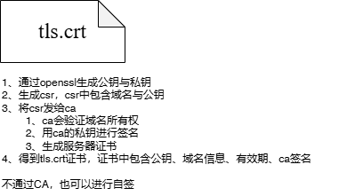

<pre>
客户端                                        服务器
-------------------------------------------------------------
1️⃣ ClientHello -----------------------------> 
   - 支持的 TLS 版本
   - 支持的加密套件
   - 客户端随机数
   - 可选扩展（SNI, ALPN, etc.）

                                       2️⃣ ServerHello
                                          - 选定 TLS 版本
                                          - 选定加密套件
                                          - 服务端随机数
                                       3️⃣ Certificate
                                          - 服务器证书(tls.crt)
                                          - 公钥
                                          - CA签名
                                       4️⃣ ServerHelloDone
   <-------------------------------------

5️⃣ 客户端解析并验证证书
   - 验证 CA 签名
   - 验证域名 CN/SAN
   - 验证有效期 NotBefore/NotAfter
   - 验证证书链是否可信
   - 可选检查撤销状态 (OCSP/CRL)

6️⃣ ClientKeyExchange ---------------------> 
   - RSA: 生成Pre-Master Secret 用服务器公钥加密

7️⃣ 客户端生成 Session Key = PRF(Pre-Master Secret + ClientRandom + ServerRandom)
   服务器生成 Session Key = PRF(Pre-Master Secret + ClientRandom + ServerRandom)

8️⃣ ChangeCipherSpec ---------------------> 
   - 告诉服务器后续数据将使用 session key 加密
                                       <--------------------- ChangeCipherSpec
                                          - 服务器通知客户端加密生效

9️⃣ Finished -----------------------------> 
   - 握手摘要，用 session key 加密
                                       <--------------------- Finished
                                          - 握手摘要验证完成

🔒 TLS 握手完成，双方建立安全通道
   - 后续应用数据使用对称加密传输
</pre>

## tls.crt

