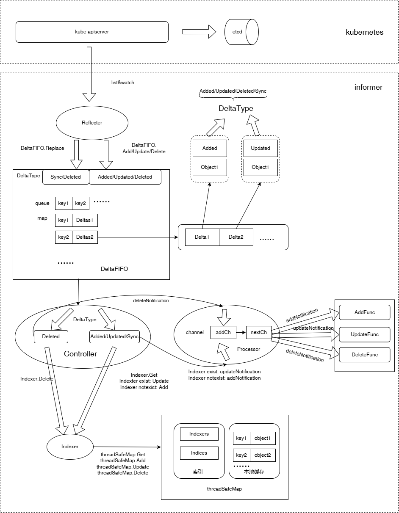

## Informer架构分析

### Informer
informer实现了持续获取集群所有资源对象、监听集群资源对象变化功能，并在本地维护了全量资源对象的内存缓存，以减少对apiserver、etcd请求的压力。Informer在启动的时候会首先在客户端调用List接口来获取全量的对象集合，然后通过Watch接口来获取增量的对象，然后更新本地缓存。

当长期运行的watch连接中断时，informers会尝试拉起一个新的watch请求来恢复连接，在不丢失任何事件的情况下恢复事件流。另外，informers还可以配置一个重新同步的周期参数，每间隔该周期，informers就会重新List全量数据。

在informer的使用上，通常每个GroupVersionResource(GVR)只实例化一个informers，但有时候我们在一个应用中往往会在多个地方对同一种资源对象都有informer的需求，所以就有了共享informer，即SharedInformerFactory。即可以通过使用SharedInformerFactory来实例化informers，这样本地内存只缓存一份，提高了效率，减少了资源浪费。

### Informer架构图


#### Reflector
1. Reflector从kube-apiserver中list资源对象列表，然后调用DeltaFIFO的Replace方法将object包装成Sync/Deleted类型的Delta放进DeltaFIFO中。
2. Reflector从kube-apiserver中watch资源对象的变化，然后调用DeltaFIFO的Add/Update/Delete行为包装成Added/Updated/Deleted类型的Delta丢到DeltaFIFO中

#### DeltaFIFO
DeltaFIFO中存储一个queue、一个map
1. queue可以看成是一个先进先出队列，一个object进入DeltaFIFO中，会判断queue中是否已经存在该object key，不存在则添加到队尾；
2. map：map[object key]Deltas，是object key和Deltas的映射，Deltas是Delta的切片类型，Delta中存储着DeltaType和object；另外，Deltas最末尾的两个Deleted类型的Delta会被去重；
```go
DeltaType有4种，分别是Added、Updated、Deleted、Sync
```
#### Controller
Controller从DeltaFIFO的queue中pop一个object key出来，并从DeltaFIFO的map中获取其对应的 Deltas出来进行处理，遍历Deltas，根据object的变化类型更新Indexer本地缓存，并通知Processor相关对象有变化事件发生：
1. 如果DeltaType是Deleted，则调用Indexer的Delete方法，将Indexer本地缓存中的object删除，并构造deleteNotification struct，通知Processor做处理；
2. 如果DeltaType是Added/Updated/Sync，调用Indexer的Get方法从Indexer本地缓存中获取该对象，存在则调用Indexer的Update方法来更新Indexer缓存中的该对象，随后构造updateNotification struct，通知Processor做处理；如果Indexer中不存在该对象，则调用Indexer的Add方法将该对象存入本地缓存中，并构造addNotification struct，通知Processor做处理；

#### Processor
Processor根据Controller的通知，即根据对象的变化事件类型（addNotification、updateNotification、deleteNotification），调用相应的ResourceEventHandler（addFunc、updateFunc、deleteFunc）来处理对象的变化。

#### Indexer
Indexer中有informer维护的指定资源对象的相对于etcd数据的一份本地内存缓存，可通过该缓存获取资源对象，以减少对apiserver、对etcd的请求压力。

informer所维护的缓存依赖于threadSafeMap结构体中的items属性，其本质上是一个用map构建的键值对，资源对象都存在items这个map中，key为资源对象的namespace/name组成，value为资源对象本身，这些构成了informer的本地缓存。

Indexer除了维护了一份本地内存缓存外，还有一个很重要的功能，便是索引功能了。索引的目的就是为了快速查找，比如我们需要查找某个node节点上的所有pod、查找某个命名空间下的所有pod等，利用到索引，可以实现快速查找。关于索引功能，则依赖于threadSafeMap结构体中的indexers与indices属性。

#### ResourceEventHandler
用户根据自身处理逻辑需要，注册自定义的的ResourceEventHandler，当对象发生变化时，将触发调用对应类型的ResourceEventHandler来做处理。
