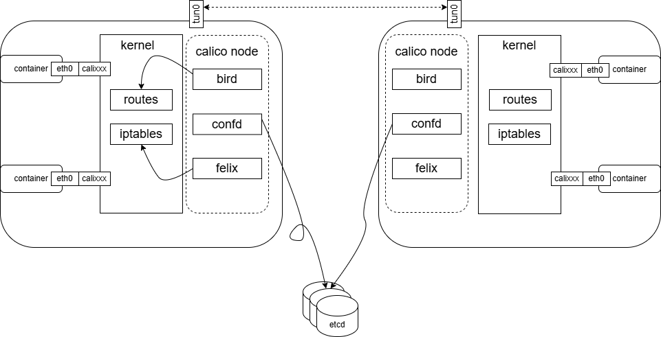
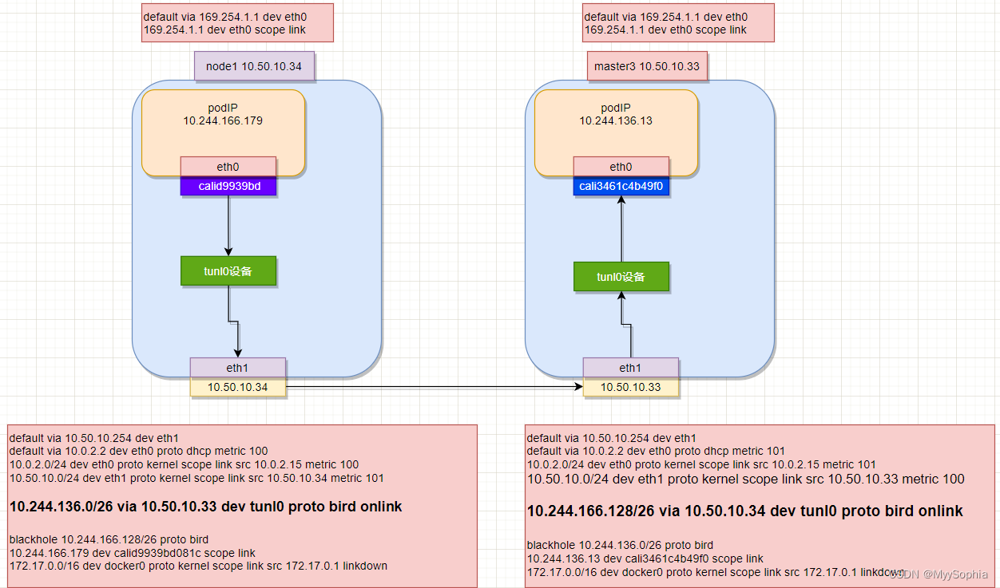
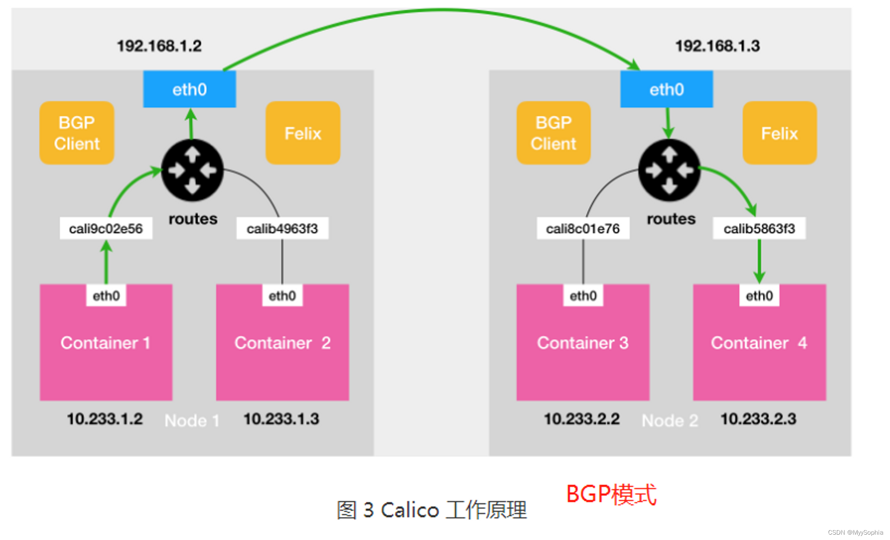

## Calico

Calico是一个纯三层的协议，一种pod之间互通的网络方案。
Calico在每个宿主机节点上利用linux kernel实现了一个高效的vRouter负责数据转发，每个vRouter通过BGP协议负责把本节点上运行的容器的路由信息在整个Calico网络内部传播，同时在本机设置到达其他节点的路由转发规则，确保所有容器之间的流量都是通过IP包的形式完成互联。简单理解就是通过在主机上启动虚拟路由器(calico node)，将每个主机作为路由器使用实现互联互通的网络拓扑。 Calico通过IPPool为每个宿主机配置独立的subnet。Calico提供了强大的网络策略(Policy)实现各种场景需求的访问控制。 在数据存储上Calico支持etcd和kubernetes两种datastore，使用etcd存储时calico将直接连接etcd集群，使用kubernetes存储时，calico将连接k8s的api server。



### calico-node的核心组件

- felix：每个calico node上都要运行一个felix组件，该组件负责配置路由及ACL等信息，并确保该主机上endpoints(接入到calico网络中的网卡称为endpoint)的连通性。
- bird：BGPClient, 每个calico node上都要运行一个bird，bird将felix写入kernel的路由信息分发给网络上其他的BGP peers。简单理解bird就是BGP守护进程负责将路由信息分发给其他节点。
- confd：每个calico node上都要运行一个confd，confd监听calico datastore中的配置变化并更新bird的配置文件。

### Calico的网络模式
- IPIP：将一个IP包封装到另一个IP包中，把IP层封装到IP层的一个tunnel中，通过两端的路由做一个tunnel，把两个原来不通的网络通过点对点连接。ipip是linux内核模块，加载ipip模块后可以使用IP-in-IP Tunnel。calico以ipip模式运行时，每个主机上会出现一个tunl0的网卡设备用来进行ipip tunnel的封装。
- BPG：将节点做为虚拟路由器通过 BGP 路由协议来实现集群内容器之间的网络访问。
- cross-subnet：Calico-ipip 模式和 calico-bgp 模式都有对应的局限性，对于一些主机跨子网而又无法使网络设备使用 BGP 的场景可以使用 cross-subnet 模式，实现同子网机器使用 calico-BGP 模式，跨子网机器使用 calico-ipip 模式。

### IPIP模式下通信

1. ping 数据包从pod1从容器的eth0发出后，发现目标ip不是一个子网，所以直接走网关出去
2. pod 的网关是169.254.1.1（使用calico创建的Pod，网关都是169.254.1.1）
3. 对网关IP发起ARP请求，谁是169.254.1.1？mac地址是？发现是一个全E的MAC地址
```shell
[root@node2 ~]#arping 169.254.1.1
ARPING 169.254.1.1 from 10.244.104.5 eth0
Unicast reply from 169.254.1.1 [EE:EE:EE:EE:EE:EE]  0.540ms
Unicast reply from 169.254.1.1 [EE:EE:EE:EE:EE:EE]  0.550ms
Unicast reply from 169.254.1.1 [EE:EE:EE:EE:EE:EE]  0.540ms
```
4. node1的 veth par 端calixxx收到 这个ARP 请求。通过开启网卡的代理 ARP(proxy_arp) 功能直接把自己的 MAC 地址返回给 pod1。pod1中的mac 和calixx的mac都是全e，通过在宿主机上查询ARP表得知需要转达到哪个calixxx。

**proxy_arp功能是将网卡收到的所有arp请求都发送一个回包，返回的是自己的mac地址。在calico这里就是全是e的mac地址。calico在node上创建的每一张网卡都开启了proxy_arp功能**
5. pod1 发送目的地址为pod2的IP 数据包(1-4主要是构造二层包)
6. 不在一个子网，本地无法处理，数据包查找本地路由表，匹配到如下路由表:
```shell
10.244.136.0/26 via 10.50.10.33 dev tunl0 proto bird onlink
```
**经过tunl0封包之后转发到10.50.10.33 也就是master3。此时IP数据报中Inner IP Header的IP：10.244.166.179 --> 10.244.136.13, OuterIP Header：10.50.10.34 → 10.50.10.33。这是IPIP模式的关键。**
7. tunl0收到数据包之后会按照ipip协议规范对进来的IP数据包封装一层外层IP头，外层IP的目的ip地址根据6步骤中的路由设置目的ip为网关10.50.10.33，外层IP的源ip地址为本node的ip 10.50.10.34。此时IP数据报变为:
Outer IP Header的IP：10.50.10.34 --> 10.50.10.33；
Inner IP Header的IP：10.244.166.179 --> 10.244.136.13。
tunl0把接收到的数据包封装成ipip报文直接发给tcp/ip协议栈。（走协议栈是要经过netfilter表的）
8. cp/ip协议栈根据ipip报文的目的地址和系统路由表(如果在一个子网就不需要)，知道目的地址为10.50.10.33的数据报需要通过node master3 的eth0发送。
9. 数据包最终到达master3上的路由10.244.136.13 dev cali3461c4b49f0 scope link
10. 此时消息转发到了master3的veth pair calixxx端的设备，这个设备和容器另外一段的veth pair进行通信

#### tun0的作用
TUN 设备是一种工作在三层（Network Layer）的虚拟网络设备。TUN 设备的功能非常简单，即：在操作系统内核和用户应用程序之间传递 IP 包。
Calico 使用的这个 tunl0 设备，是一个 IP 隧道（IP tunnel）设备。
IP 包进入 IP 隧道设备之后，就会被 Linux 内核的 IPIP 驱动接管。IPIP 驱动会将这个 IP 包直接封装在一个宿主机网络的 IP 包中。
calico在使用ipip模式之后，每个node上会自动添加一个tunl0网卡，用于IPIP协议的支持。

#### 什么是proxy_arp
当arp请求目标网段的时候，网关收到ARP请求之后会用自己的MAC地址返回给请求者。k8中arp代理功能在calixxx 所在宿主机上开启.
```shell
cat /proc/sys/net/ipv4/conf/calid9939bd081c/proxy_arp
1
```
Calico 通过一个巧妙的方法将 workload 的所有流量引导到一个特殊的网关 2.169.254.1.1，从而引流到主机的 calixxx 网络设备上，最终将二三层流量全部转换成三层流量来转发。在主机上通过开启代理 ARP 功能来实现 ARP 应答，使得 ARP 广播被抑制在主机上，抑制了广播风暴，也不会有 ARP 表膨胀的问题。

### BGP模式
BGP模式不需要将包再封装一层，所以速度更快。


### BGP模式的限制
BGP模式和flannel 的host-gateway模式类似需要保证集群node几点的二层互通,即再一个子网中。
Calico 项目实际上将集群里的所有节点，都当作是边界路由器来处理，它们一起组成了一个全连通的网络，互相之间通过 BGP 协议交换路由规则。这些节点，我们称为 BGP Peer。

### calico中BGP的的Node-to-Node Mesh 模式和Route Reflector 的模式区别与使用场景？

#### Node-to-Node Mesh
每台宿主机上的 BGP Client 都需要跟其他所有节点的 BGP Client 进行通信以便交换路由信息。但是，随着节点数量 N 的增加，这些连接的数量就会以 N²的规模快速增长，从而给集群本身的网络带来巨大的压力。推荐少于 100 个节点的集群里

#### Route Reflector
Route Reflector 的模式 时Calico 会指定一个或者几个专门的节点，来负责跟所有节点建立 BGP 连接从而学习到全局的路由规则。而其他节点，只需要跟这几个专门的节点交换路由信息，就可以获得整个集群的路由规则信息了。大规模集群推荐使用。

### ipvs 模式下主机上的kube-ipvs0设备是什么？
ube-proxy首先会创建一个dummy虚拟网卡kube-ipvs0，然后把所有的Service IP添加到kube-ipvs0中。正式因为这个虚拟设备的存在ping svcIP 才有回应。如果是iptables mode svcip ping不通，因为没有设备响应。

### 容器世界的veth pari性能损耗
容器使用的网络技术中基本都是通过veth-pair把容器和外界连通起来的，然后外面或者通过直接路由(BGP)或者通过overlay(vxlan、IPinIP等)的方式再出宿主机。

而仅仅veth-pair就会造成10%的网络延迟（QPS大约减少5%），这是因为虽然 veth 是一个虚拟的网络接口，但是在接收数据包的操作上，这个虚拟接口和真实的网路接口并没有太大的区别。这里除了没有硬件中断的处理，其他操作都差不多，特别是软中断（softirq）的处理部分其实就和真实的网络接口是一样的.**在对外发送数据的时候，peer veth 接口都会 raise softirq 来完成一次收包操作，这样就会带来数据包处理的额外开销。**如果要减小容器网络延时，就可以给容器配置 ipvlan/macvlan 的网络接口来替代 veth 网络接口。Ipvlan/macvlan 直接在物理网络接口上虚拟出接口，在发送对外数据包的时候可以直接通过物理接口完成，没有节点内部类似 veth 的那种 softirq 的开销。**容器使用 ipvlan/maclan 的网络接口，它的网络延时可以非常接近物理网络接口的延时。**对于延时敏感的应用程序，我们可以考虑使用 ipvlan/macvlan 网络接口的容器。不过，由于 ipvlan/macvlan 网络接口直接挂载在物理网络接口上，对于需要使用 iptables 规则的容器，比如 Kubernetes 里使用 service 的容器，就不能工作了。这就需要你结合实际应用的需求做个判断，再选择合适的方案。