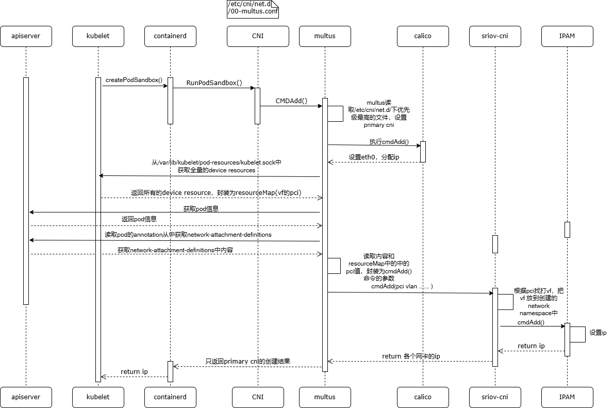

# cni的调用流程

kubelet (createPodSandbox) -> CRI -> containerd(RunPodSandbox) -> carete network namespace -> cni -> CmdAdd(/etc/cni/net.d/) -> multus -> calico
                                                      -> sriov-cni -> IPAM



## 问题
1、createPodSandbox()传入的PodSandboxConfig{}中并没有对应的devxxxx，vf是如何在cni的调用流程中分配的？ContainerConfig{}中传入的每个容器的devxxxx，但是ContainerConfig{}是在cni流程结束之后，kubelet创建CreateContainer()的时候调用的。

PodSandboxConfig{}和ContainerConfig{}如下所示：
```go
PodSandboxConfig{
  Metadata: &PodSandboxMetadata{
    Name: "xxxx-pvc-f14dc316-073c-4f4e-a8de-460310a7b541",
    Uid: "db26f20e-51ec-497e-b991-4c43c9bea66b",
    Namespace: "xxx-system",
    Attempt: 0,
  },
  Hostname: "xxxx-pvc-f14dc316-073c-4f4e-a8de-460310a7b541",
  LogDirectory: "/var/log/pods/xxxx-system_share-manager-pvc-f14dc316-073c-4f4e-a8de-460310a7b541_db26f20e-51ec-497e-b991-4c43c9bea66b",
  DnsConfig: &DNSConfig{
    Servers: ["10.96.0.10"],
    Searches: [
      "xxxx-system.svc.cluster.local",
      "svc.cluster.local",
      "cluster.local"
    ],
    Options: ["ndots:5"],
  },
  PortMappings: [],
  Labels: {
    "io.kubernetes.pod.name": "share-manager-pvc-f14dc316-073c-4f4e-a8de-460310a7b541",
    "io.kubernetes.pod.namespace": "xxxx-system",
    "io.kubernetes.pod.uid": "db26f20e-51ec-497e-b991-4c43c9bea66b",
    "xxxx.io/component": "share-manager",
    "xxxx.io/managed-by": "xxxx-manager",
    "xxxx.io/share-manager": "pvc-f14dc316-073c-4f4e-a8de-460310a7b541",
    "xxxx.io/share-manager-image": "smi-4086293c"
  },
  Annotations: {
    "kubernetes.io/config.seen": "2026-01-19T17:08:06.777541520+08:00",
    "kubernetes.io/config.source": "api",
    "xxxx.io/last-applied-tolerations": "[]"
  },
  Linux: &LinuxPodSandboxConfig{
    CgroupParent: "/kubepods.slxxxx/kubepods-besteffort.slxxxx/kubepods-besteffort-poddb26f20e_51ec_497e_b991_4c43c9bea66b.slxxxx",
    SecurityContext: &LinuxSandboxSecurityContext{
      NamespaceOptions: &NamespaceOption{
        Network: POD,
        Pid: CONTAINER,
        Ipc: POD,
        TargetId: "",
        UsernsOptions: nil
      },
      SelinuxOptions: nil,
      RunAsUser: nil,
      ReadonlyRootfs: false,
      SupplementalGroups: [],
      Privileged: true,  // 注意：这个 Pod 有特权模式
      SeccompProfilePath: "",
      RunAsGroup: nil,
      Seccomp: &SecurityProfile{
        ProfileType: RuntimeDefault,
        LocalhostRef: ""
      },
      Apparmor: nil
    },
    Sysctls: {},
    Overhead: &LinuxContainerResources{
      CpuPeriod: 0,
      CpuQuota: 0,
      CpuShares: 0,
      MemoryLimitInBytes: 0,
      OomScoreAdj: 0,
      CpusetCpus: "",
      CpusetMems: "",
      HugepageLimits: [],
      Unified: {},
      MemorySwapLimitInBytes: 0
    },
    Resources: &LinuxContainerResources{
      CpuPeriod: 10000,
      CpuQuota: 0,  // 注意：CPU 配额为 0，表示无限制
      CpuShares: 2,  // 非常低的 CPU 份额（最低优先级）
      MemoryLimitInBytes: 0,  // 内存无限制
      OomScoreAdj: 0,
      CpusetCpus: "",
      CpusetMems: "",
      HugepageLimits: [],
      Unified: {},
      MemorySwapLimitInBytes: 0
    }
  },
  Windows: nil
}

ContainerConfig{
  Metadata: &ContainerMetadata{
    Name: "icr",
    Attempt: 0,
  },
  Image: &ImageSpec{
    Image: "sha256:eef3281cff7ca093d8ebb89de379a0716fd33d91b8e123f65fdd986577c75c0b",
    Annotations: {},
  },
  Command: [
    "/bin/bash -c python2.7 /root/ApcUpgrader/manage.py runserver 0.0.0.0:9988 &",
    "/opt/xxxx/xxxx/bin/xxxxNodeServxxxx"
  ],
  Args: [],
  WorkingDir: "",
  Envs: [
    // PCI 设备环境变量
    &KeyValue{Key: "PCIDEVxxxx_INTEL_COM_SRIOV_NET_A_INFO", Value: "{\"0000:17:13.6\":{\"generic\":{\"devxxxxID\":\"0000:17:13.6\"}},\"0000:17:14.7\":{\"generic\":{\"devxxxxID\":\"0000:17:14.7\"}}}"},
    &KeyValue{Key: "PCIDEVxxxx_INTEL_COM_SRIOV_NET_A", Value: "0000:17:13.6,0000:17:14.7"},
    &KeyValue{Key: "PCIDEVxxxx_INTEL_COM_SRIOV_NET_B_INFO", Value: "{\"0000:ca:13.6\":{\"generic\":{\"devxxxxID\":\"0000:ca:13.6\"}},\"0000:ca:15.1\":{\"generic\":{\"devxxxxID\":\"0000:ca:15.1\"}}}"},
    &KeyValue{Key: "PCIDEVxxxx_INTEL_COM_SRIOV_NET_B", Value: "0000:ca:13.6,0000:ca:15.1"},
    
    // Java 堆设置
    &KeyValue{Key: "MAX_HEAP_SIZE", Value: "512M"},
    &KeyValue{Key: "HEAP_NEWSIZE", Value: "100M"},
    
    // xxxx 配置
    &KeyValue{Key: "xxxx_NAME", Value: "xxxx4"},
    &KeyValue{Key: "POD_IP", Value: "10.244.236.87"},
    &KeyValue{Key: "HOST_IP", Value: "192.168.203.101"},
    
    // 大量的服务发现环境变量（约 220+ 个）
    // 主要是其他服务的 IP、端口、协议信息
    &KeyValue{Key: "REDU_SVC_xxxx2_1_PORT_2202_TCP", Value: "tcp://10.101.76.85:2202"},
    &KeyValue{Key: "DESIGNER_SVC_PORT_443_TCP_PROTO", Value: "tcp"},
    // ... (省略 200+ 个环境变量)
  ],
  Mounts: [
    &Mount{
      ContainerPath: "/data/xxxx/config",
      HostPath: "/var/lib/kubelet/pods/0e7ee6b5-c2e0-45e8-9bab-b959402695ef/volumes/kubernetes.io~csi/pvc-7fc88a13-57a5-4ef9-8565-35ef9c120b31/mount",
      Readonly: false,
      SelinuxRelabel: false,
      Propagation: PROPAGATION_PRIVATE
    },
    &Mount{
      ContainerPath: "/data/xxxx/run",
      HostPath: "/var/lib/kubelet/pods/0e7ee6b5-c2e0-45e8-9bab-b959402695ef/volumes/kubernetes.io~csi/pvc-f14dc316-073c-4f4e-a8de-460310a7b541/mount",
      Readonly: false,
      SelinuxRelabel: false,
      Propagation: PROPAGATION_PRIVATE
    },
    &Mount{
      ContainerPath: "/usr/local/xxxx",
      HostPath: "/var/lib/kubelet/pods/0e7ee6b5-c2e0-45e8-9bab-b959402695ef/volumes/kubernetes.io~csi/pvc-73bf6163-e273-4942-876a-0cb8bc546c73/mount",
      Readonly: false,
      SelinuxRelabel: false,
      Propagation: PROPAGATION_PRIVATE
    },
    &Mount{
      ContainerPath: "/var/core",
      HostPath: "/var/k8s/core/xxxx/storage-test/xxxx4",
      Readonly: false,
      SelinuxRelabel: false,
      Propagation: PROPAGATION_PRIVATE
    },
    &Mount{
      ContainerPath: "/var/run/k8s_node_status",
      HostPath: "/var/run/k8s_node_status",
      Readonly: true,
      SelinuxRelabel: false,
      Propagation: PROPAGATION_PRIVATE
    },
    &Mount{
      ContainerPath: "/etc/localtime",
      HostPath: "/etc/localtime",
      Readonly: true,
      SelinuxRelabel: false,
      Propagation: PROPAGATION_PRIVATE
    },
    &Mount{
      ContainerPath: "/etc/hosts",
      HostPath: "/var/lib/kubelet/pods/0e7ee6b5-c2e0-45e8-9bab-b959402695ef/etc-hosts",
      Readonly: false,
      SelinuxRelabel: false,
      Propagation: PROPAGATION_PRIVATE
    },
    &Mount{
      ContainerPath: "/dev/termination-log",
      HostPath: "/var/lib/kubelet/pods/0e7ee6b5-c2e0-45e8-9bab-b959402695ef/containers/icr/e0a82495",
      Readonly: false,
      SelinuxRelabel: false,
      Propagation: PROPAGATION_PRIVATE
    }
  ],
  Devxxxxs: [],
  Labels: {
    "io.kubernetes.container.name": "icr",
    "io.kubernetes.pod.name": "xxxx4-1",
    "io.kubernetes.pod.namespace": "storage-test",
    "io.kubernetes.pod.uid": "0e7ee6b5-c2e0-45e8-9bab-b959402695ef"
  },
  Annotations: {
    "io.kubernetes.container.hash": "48cd3737",
    "io.kubernetes.container.hashWithoutResources": "5374a47",
    "io.kubernetes.container.ports": `[{"name":"intra-website","containerPort":9988,"protocol":"TCP"},{"name":"intra-shellbox","containerPort":2202,"protocol":"TCP"},{"name":"intra-ns","containerPort":17001,"protocol":"TCP"},{"name":"intra-mb","containerPort":17003,"protocol":"TCP"},{"name":"intra-ss","containerPort":17006,"protocol":"TCP"},{"name":"softbus-net-a","containerPort":17040,"protocol":"UDP"},{"name":"softbus-net-b","containerPort":17041,"protocol":"UDP"},{"name":"io-net-udp","containerPort":17042,"protocol":"UDP"},{"name":"io-net-ucp","containerPort":18688,"protocol":"UDP"},{"name":"io-net-hart","containerPort":5094,"protocol":"TCP"},{"name":"sshd","containerPort":22,"protocol":"TCP"}]`,
    "io.kubernetes.container.preStopHandler": `{"exec":{"command":["kill -9 $(pgrep xxxxNodeServxxxx)"]}}`,
    "io.kubernetes.container.restartCount": "0",
    "io.kubernetes.container.terminationMessagePath": "/dev/termination-log",
    "io.kubernetes.container.terminationMessagePolicy": "File",
    "io.kubernetes.pod.terminationGracePeriod": "3"
  },
  LogPath: "icr/0.log",
  Stdin: false,
  StdinOnce: false,
  Tty: false,
  Linux: &LinuxContainerConfig{
    Resources: &LinuxContainerResources{
      CpuPeriod: 10000,
      CpuQuota: 10000,      // 相当于 1 个 CPU 核心
      CpuShares: 1024,
      MemoryLimitInBytes: 3221225472,  // 3GB
      OomScoreAdj: -997,     // 非常不容易被 OOM 杀死
      CpusetCpus: "6",       // 绑定到 CPU 6
      CpusetMems: "0",
      HugepageLimits: [&HugepageLimit{PageSize: "2MB", Limit: 0}],
      Unified: {},
      MemorySwapLimitInBytes: 3221225472
    },
    SecurityContext: &LinuxContainerSecurityContext{
      Capabilities: &Capability{
        AddCapabilities: [
          "NET_RAW", "NET_BIND_SERVxxxx", "NET_ADMIN", "NET_BROADCAST",
          "IPC_LOCK", "SYS_PTRACE", "KILL", "CHOWN", "FOWNER", 
          "SETGID", "SETUID", "SYS_Nxxxx"
        ],
        DropCapabilities: [
          "MKNOD", "FSETID", "FSETGID", "SETPCAP", "SETFCAP",
          "SYS_CHROOT", "DAC_OVERRIDE"
        ],
        AddAmbientCapabilities: []
      },
      Privileged: false,
      NamespaceOptions: &NamespaceOption{
        Network: POD,
        Pid: POD,
        Ipc: POD,
        TargetId: "",
        UsernsOptions: nil
      },
      SelinuxOptions: nil,
      RunAsUser: &Int64Value{Value: 0},  // root 用户
      RunAsUsername: "",
      ReadonlyRootfs: false,
      SupplementalGroups: [],
      ApparmorProfile: "",
      SeccompProfilePath: "",
      NoNewPrivs: true,
      RunAsGroup: nil,
      MaskedPaths: [
        "/proc/asound", "/proc/acpi", "/proc/kcore", "/proc/keys",
        "/proc/latency_stats", "/proc/timer_list", "/proc/timer_stats",
        "/proc/sched_debug", "/proc/scsi", "/sys/firmware",
        "/sys/devxxxxs/virtual/powercap"
      ],
      ReadonlyPaths: [
        "/proc/bus", "/proc/fs", "/proc/irq", "/proc/sys",
        "/proc/sysrq-trigger"
      ],
      Seccomp: &SecurityProfile{
        ProfileType: RuntimeDefault,
        LocalhostRef: ""
      },
      Apparmor: nil
    }
  },
  Windows: nil,
  CDIDevxxxxs: []
}

```
结论：
```
在cni的调用流程中，multus会通过调用/var/lib/kubelet/pod-resources/kubelet.sock获取全量的device，然后再将对应的device（vf）分配到指定的pod中。
```