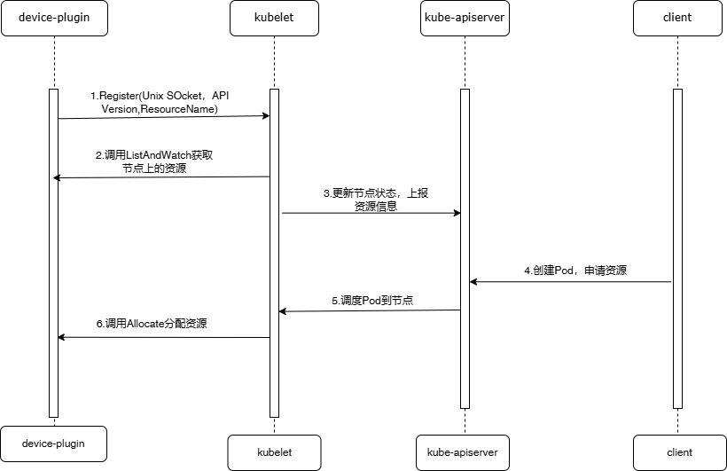

## Device Plugin

### Device Plugin产生原因
- 核心目标：标准化设备管理接口，实现动态注册、发现、分配、监控的闭环
- 关键设计思想：
  - 插件化结构：硬件厂商只需要实现Device Plugin接口，无需修改kubelet核心代码。
  - gRPC长连接通信：通过ListAndWatch接口实时同步设备列表与监控状态。
  - 资源分配原子性：kubelet在pod调度成功后直接调用Allocate接口，确保设备初始化与容器启动的原子性

### GPU场景
- 大模型场景
  - 设备隔离性：多个Pod共享物理GPU时需隔离现存与计算单元
  - 驱动兼容性：容器内GPU驱动版本需与宿主机一致（通过nvidia-docker2的-gpus参数注入设备）
  - 资源超分：通过vGPU技术（如vCUDA）实现单卡多容器共享
- Device Plugin的作用
  - 自动挂载设备与驱动库：通过Allocate返回的mounts将libcuda.so等库注入容器
  - 健康检查：监控GPU的XID错误（通过vidia-smi查询），自动标记故障设备

### Device Plugin核心架构

- kubelet中关于device plugin的逻辑：主要负责管理各种注册上来的device plugin，以及创建pod容器时向device plugin服务申请资源
- 节点中的device plugin逻辑：向Kubelet注册自身，管理节点上的设备以及向Kubelet上报设备列表和健康状态等信息

### Device Plugin GRPC proto定义与核心接口解析
在device plugin逻辑中kubelet和插件中各起了一个GRPC server。下面是接口定义
```go
// kubelet GRPC server
// Registration is the service advertised by the Kubelet
// Only when Kubelet answers with a success code to a Register Request
// may Device Plugins start their service
// Registration may fail when device plugin version is not supported by
// Kubelet or the registered resourceName is already taken by another
// active device plugin. Device plugin is expected to terminate upon registration failure
service Registration {
    rpc Register(RegisterRequest) returns (Empty) {}
}

// 插件GRPC server
// DevicePlugin is the service advertised by Device Plugins
service DevicePlugin {
    // GetDevicePluginOptions returns options to be communicated with Device
    // Manager
    rpc GetDevicePluginOptions(Empty) returns (DevicePluginOptions) {}

    // ListAndWatch returns a stream of List of Devices
    // Whenever a Device state change or a Device disappears, ListAndWatch
    // returns the new list
    rpc ListAndWatch(Empty) returns (stream ListAndWatchResponse) {}

    // GetPreferredAllocation returns a preferred set of devices to allocate
    // from a list of available ones. The resulting preferred allocation is not
    // guaranteed to be the allocation ultimately performed by the
    // devicemanager. It is only designed to help the devicemanager make a more
    // informed allocation decision when possible.
    rpc GetPreferredAllocation(PreferredAllocationRequest) returns (PreferredAllocationResponse) {}

    // Allocate is called during container creation so that the Device
    // Plugin can run device specific operations and instruct Kubelet
    // of the steps to make the Device available in the container
    rpc Allocate(AllocateRequest) returns (AllocateResponse) {}

    // PreStartContainer is called, if indicated by Device Plugin during registeration phase,
    // before each container start. Device plugin can run device specific operations
    // such as resetting the device before making devices available to the container
    rpc PreStartContainer(PreStartContainerRequest) returns (PreStartContainerResponse) {}
}
```
#### ListAndWatch
1. 设备发现与状态监控
2. 初始设备列表上报：当设备插件启动时，kubelet 调用此方法获取当前节点上所有可用设备的详细信息（如设备 ID、健康状态）；
3. 实时状态更新：通过 GRPC 流（streaming）持续向kubelet推送设备状态变化（如设备故障、恢复或新增设备）。
4. 设备信息同步：设备插件返回一个设备列表，每个设备包含以下信息，kubelet缓存这些信息，并更新节点的资源容量（Capacity）和可分配资源（Allocatable）：
```go
message Device {
    string ID = 1;            // 设备唯一标识（如 GPU UUID）
    string health = 2;        // 健康状态（`Healthy` 或 `Unhealthy`）
    repeated DeviceTopology topology = 3; // 拓扑信息（如 NUMA 节点、PCI 总线）
}
```
5. 长连接维护：ListAndWatch建立了一个持久的GRPC流连接，设备插件可以随时通过此流发送状态更新；若连接断开，kubelet会尝试重新连接，并重新获取完整的设备列表。
6. 健康状态管理：设备插件负责监控设备健康（如通过驱动检测GPU的温度或错误状态），并通过流推送变更；当设备标记为Unhealthy时，kubelet不再将其分配给新Pod。

#### Allocate
1. 核心作用：资源分配与设备初始化。当Pod被调度到节点后，kubelet调用此方法，要求设备插件为容器分配具体的设备资源，返回容器访问设备所需的配置（如挂载路径、环境变量）。
2. 设备分配逻辑：kubelet传递需要分配的设备ID列表（从调度结果中获取），设备插件需确保这些设备可用，并执行必要的初始化操作：
```go
message AllocateRequest {
    repeated ContainerAllocateRequest container_requests = 1;
}

message ContainerAllocateRequest {
    repeated string devicesIDs = 1; // 请求分配的设备 ID（如 ["GPU-1234"]）
}
```
返回容器配置：插件返回容器运行时所需的配置信息，kubelet将这些配置注入容器，使其能正确访问设备：
```go
message AllocateResponse {
    repeated ContainerAllocateResponse container_responses = 1;
}

message ContainerAllocateResponse {
    repeated Device mounts = 1;    // 设备挂载路径（如 /dev/nvidia0）
    map<string, string> envs = 2;  // 环境变量（如 NVIDIA_VISIBLE_DEVICES）
    repeated DeviceSpec devices = 3; // 设备权限（如 cgroup 配置）
}
```
3. 资源原子性保证:分配过程是原子的，确保设备在容器启动前已准备好（避免竞态条件）；若分配失败（如设备已被占用），kubelet会触发Pod调度失败

### 设备注册机制与资源上报流程
- 设备注册机制（设备插件的启动与自检）
1. 资源发现：设备插件（如nvidia-device-plugin）启动后，首先扫描宿主机上的物理设备（如通过 nvidia-smi 获取 GPU 信息）；创建Unix Socket文件：/var/lib/kubelet/device-plugins/目录下创建.sock文件（如nvidia-gpu.sock），作为与kubelet通信的端点；启动GRPC服务：实现Device Plugin的GRPC接口，包括ListAndWatch和Allocate方法；
2. 向kubelet注册设备：调用kubelet GRPC Register接口：设备插件通过/var/lib/kubelet/device-plugins/kubelet.sock文件，使用GRPC的方式调用kubelet 提供的Registration API（GRPC 服务）发送注册请求，包含以下关键信息：
```go
message RegisterRequest {
    string version = 1;          // 设备插件API版本（如 "v1beta1"）
    string endpoint = 2;          // Unix Socket路径（如 "nvidia-gpu.sock"）
    string resource_name = 3;     // 资源名称（如 "nvidia.com/gpu"）
    Options options = 4;          // 可选参数（如预启动容器配置）
}
```
3. kubelet处理注册请求：kubelet的PluginWatcher模块监听/var/lib/kubelet/device-plugins目录下的socket文件创建事件，并校验资源名格式（需符合[vendor-domain]/[resource-type]，如 amd.com/gpu），之后将插件信息存入EndpointStore，建立长连接管理通道。

常见的注册失败场景：资源名称冲突，例如同一资源名称已被其他插件注册；socket权限错误，例如kubelet无权限访问插件的Unix Socket；API版本不兼容，例如插件版本与kubelet支持的Device Plugin API版本不匹配。

资源上报流程：
```go
Device Plugin → kubelet (ListAndWatch) → kubelet缓存 → kubelet → API Server → etcd
```
### 设备列表上报（ListAndWatch）
1. 长连接状态同步：初始设备列表上报是kubelet调用插件的ListAndWatch接口，插件返回当前设备列表及元数据：
```go
message ListAndWatchResponse {
    repeated Device devices = 1;  // 设备列表
}
message Device {
    string ID = 1;              // 设备唯一ID（如GPU UUID）
    string health = 2;          // 健康状态（"Healthy"/"Unhealthy"）
    repeated DeviceTopology topology = 3; // 拓扑信息（NUMA节点、PCI总线）
}
```
之后插件通过ListAndWatch的GRPC Stream长期保持连接，当设备状态变化（如GPU过热）时，立即推送增量更新。kubelet收到上报信息后，会将设备信息被缓存并触发节点资源容量（Capacity）与可分配资源（Allocatable）更新。
2. 资源信息同步至API Server:kubelet的NodeStatusUpdater定期（默认10s）将节点资源总量（包括Device Plugin上报的资源）通过PATCH /api/v1/nodes/<node-name>/status更新至API Server；调度器（如kube-scheduler）监听节点资源变化，决策Pod调度时使用nvidia.com/gpu: 2 等扩展资源需求。
3. 设备拓扑信息：用于拓扑感知调度（如确保容器与设备在同一NUMA节点）
```go
message DeviceTopology {
    repeated NUMANode nodes = 1;  // 设备所属NUMA节点
}
```
资源上报参数：可通过kubelet参数调节上报行为
```go
--device-plugin-registration-timeout=10s  # 插件注册超时时间
--device-plugin-poll-interval=5s          # 插件健康检查间隔
```


### kubelet的 device plugin的部分细节
1. kubelet启动（含重启场景）会清除/var/lib/kubelet/device-plugins/目录下设备插件的socket文件，因此设备插件中需要监听kubelet重启事件（一般通过监听/var/lib/kubelet/device-plugins/kubelet.sock文件的创建事件），当设备插件发现kubelet重启，设备插件自己也需要重启逻辑（服务重启或者内部逻辑重启）
2. kubelet会把当前内存中的设备信息写入/var/lib/kubelet/device-pluginskubelet_internal_checkpoint文件中
3. device plugin负责监控其管理的硬件设备（如GPU、FPGA）的健康状态，并通过ListAndWatch GRPC方法向kubelet实时推送设备状态。kubelet侧则内存中的设备更新为不健康，不会再分配给新创建的pod。如果运行中的Pod使用了不健康设备，kubelet可能驱逐该Pod或触发重新调度（需结合集群策略）
4. 由于kubelet与device plugin服务建立了GRPC stream流连接，当device plugin服务异常时，kubelet侧能感知，并把该类型的设备都标记为不可用，阻止新Pod分配这些设备