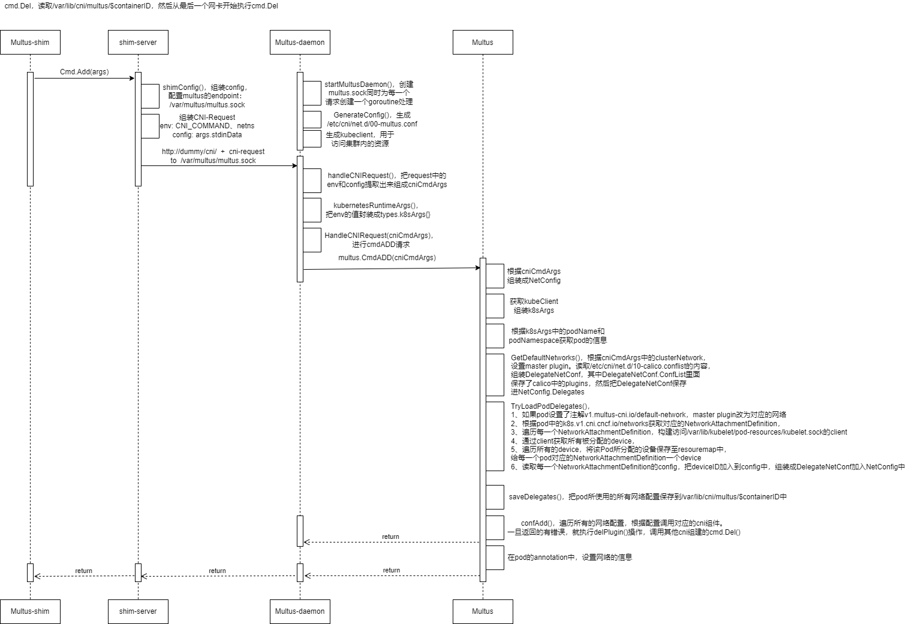

# multus
multus能够将一个pod内放置多张网卡，分为两个版本：multus-thick和multus版本。下面画出的是multus-thick的架构图。

## multus的调用
runtime ---> multus-shim ---> multus-daemon ---> delegate

## multus架构

## multus特点
1、在Multus-CNI的thick中，在/opt/cni/bin中的二进制是multus-shim，而在pod会中长久运行一个multus-daemon，multus-daemon是一个长久运行的web服务，每一个kubelet调用multus的时候，都是multus-shim发出http调用，multus-daemon接收到之后，产生一个goroutine，从而执行流程。不同于其他cni的是，其他cni每次调用，都是直接调用/opt/cni/bin下的二进制，从而触发操作，有多次调用，就会产生多少个进程。这两种方式那种更好，并不知道。

2、multus向/var/lib/kubelet/pod-resources/kubelet.sock发起请求，从而获悉pod已被分配的device。如分配vf。

3、性能问题：一个节点同时创建20个pod时，multus会oom

4、缓存问题：multus在/var/lib/cni/multus/results/ 文件夹中存放每次创建网卡的信息，但是这个文件夹在pod删除时不一定会删除，所以导致go打开小文件过多，但是无法释放（事实存在，待研究）