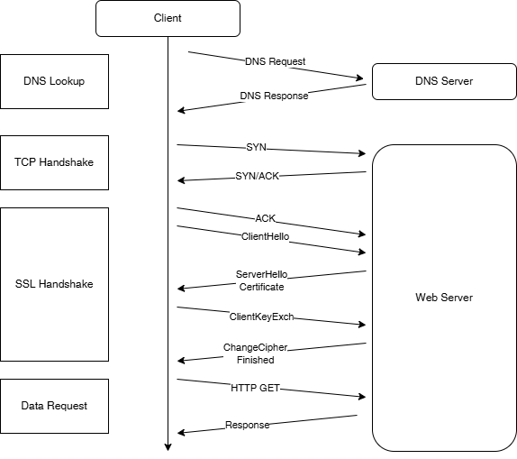

## HTTPS请求过程分析

一个完整、未复用连接的HTTPS请求需要经过5个阶段：DNS域名解析、TCP握手、SSL握手、服务器处理、内容传输。请求的各个阶段共需要 5 个 RTT（Round-Trip Time，往返时间）具体为：1 RTT（DNS Lookup，域名解析）+ 1 RTT（TCP Handshake，TCP 握手）+ 2 RTT（SSL Handshake，SSL 握手）+ 1 RTT（Data Transfer，HTTP 内容传输）。



### 请求各阶段耗时分析

可以用curl命令对HTTPS请求的各个阶段进行详细的延时分析。

curl命令提供了-w参数，允许按照指定的格式打印与请求相关的信息，其中部分信息可以通过特定的变量表示，如status_code、size_download、time_namelookup 等等。由于我们关注的是耗时分析，因此只需关注与请求延迟相关的变量（以 time_ 开头的变量）。各个阶段的耗时变量如下所示：
```shell
cat > curl-format.txt << 'EOF'
    time_namelookup:  %{time_namelookup}\n
       time_connect:  %{time_connect}\n
    time_appconnect:  %{time_appconnect}\n
      time_redirect:  %{time_redirect}\n
   time_pretransfer:  %{time_pretransfer}\n
 time_starttransfer:  %{time_starttransfer}\n
                    ----------
         time_total:  %{time_total}\n
EOF
```
### curl内部延时变量
| 变量名称            | 说明 |
|--------------------|------|
| time_namelookup    | 从请求开始到域名解析完成的时间 |
| time_connect       | 从请求开始到 TCP 三次握手完成的时间 |
| time_appconnect    | 从请求开始到 TLS 握手完成的时间 |
| time_pretransfer   | 从请求开始到发送第一个 GET/POST 请求的时间 |
| time_redirect      | 重定向过程的总时间，包括 DNS 解析、TCP 连接和内容传输前的时间 |
| time_starttransfer | 从请求开始到首个字节接收的时间 |
| time_total         | 请求总耗时 |


### HTTPS 请求各阶段耗时计算
| 阶段 | 计算公式 | 说明 |
|------|----------|------|
| 域名解析 | time_namelookup | 从发起请求到获取域名对应的 IP 地址的时间 |
| TCP 握手 | time_connect - time_namelookup | 建立 TCP 连接所需时间 |
| SSL 握手 | time_appconnect - time_connect | TLS 握手及加解密处理时间 |
| 服务器处理 | time_total - time_starttransfer | 服务器处理请求时间 |
| TTFB | time_starttransfer | 从请求开始到接收首字节的时间 |
| 总耗时 | time_total | 整个 HTTPS 请求耗时 |

## HTTPS的优化总结
1. 域名解析优化：减少域名解析产生的延时。通过缓存等。
2. 使用更现代的HTTP协议：升级至 HTTP/2，进一步升级到基于 QUIC 协议的 HTTP/3。
3. 升级拥塞控制算法以提高网络吞吐量：例如，将默认的 Cubic 升级为 BBR，对于大带宽、长链路的弱网环境尤其有效。
4. SSL层优化：升级 TLS 算法和 HTTPS 证书。例如，升级 TLS 1.3 协议，可将 SSL 握手的 RTT 从 2 个减少到 1 个。
5. 网络层优化：使用商业化的网络加速服务，通过路由优化数据包，实现动态服务加速。
6. 对传输内容进行压缩：传输数据的大小与耗时成正比，压缩传输内容是降低请求耗时最有效的手段之一。