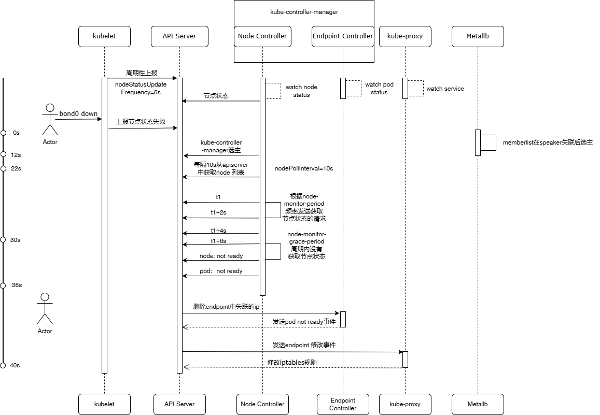

## 业务流量切换

当某个节点断网/节点关机时，Pod流量进行主备切换。监控画面是一直查看所有设备信息，要尽量做到监控画面不中断或者中断时间尽可能的缩减。


### 分析
```shell
/var/lib/kubelet/config.yaml 
    nodeLeaseDurationSeconds: 10s
/etc/kubernetes/manifests/kube-controller-manager.yaml
    node-monitor-grace-period: 40s
    node-monitor-period: 8s
```

现状：当前流量切换的时候，流量切换时长最长的是pod（接收流量的pod） + etcd (leader) + controller-manager（leader） + kube-vip（leader） 都在同一个节点中。当这个节点断网或者断电时，流量切换时长最长可达50s。

优化：
- **cluster模式**
1.  nodeLeaseDurationSeconds时长从10s缩短到更短时，出现网络波动的时候，会报node not ready，所以这个时长是不可以缩短
2.  node-monitor-grace-period 时长可以调整为 10s，node-monitor-grace-period的含义是如果在 node-monitor-grace-period 时间内，controller-manager 没有收到某个 node 的心跳，就会认为该 node 不健康。
3.  node-monitor-period 时长可以调整为2s，node-monitor-period的含义是controller-manager 多久检查一次所有 Node 的健康状态。
4.  controller-manager启动时候会每隔nodePollInterval的时长获取node的列表，可以将nodePollInterval的时长缩短至2s.
- **Local模式**
Pod的service改成Local模式，直接依赖speaker进行流量切换，此时流量的切换时延缩短至3-5s，但是后续因为节点重启，或者网络恢复的情况下，speaker又会将流量切回到原pod。在此基础之上，增加了retain机制，节点重启后arp不再飘回。Local模式下，流量切换直接依赖于speaker切换的速度，当speaker响应的节点和pod的节点在同一个节点时，speaker的切换速度也将影响流量的切换速度，所以将speaker访问apiserver的连接，替换为speaker访问kube-vip的连接，此时能大幅提升speaker的访问速度，调整之后，spaker切换只需花费1s，整个流量切换只需要3s。


### 影响node not ready的因素？
在k8s中影响node not ready的组件有两个：kubelet、kube-controller-manager。其中Kubelet回定期向发送node lease，kube-controller-manager会以node-monitor-grace-period为总时长，以node-monitor-period为频率判断node是否ready，如果超过node-monitor-grace-period没有获取结果，就会设置node not ready。

### service local/cluster两种模式的区别和联系;
Cluster和Local时流量转发的两种模式；Cluster模式流量可以转发到任意node的pod，可以跨node实现流量转发，会做SNAT;Loacl模式只会将流量转发到当前Node的Pod，不会跨Node转发，会在连接中保留真实的ClientIP。

### speaker如何通过kube-vip访问apiserver
apiserver是没有leader，speaker在连接apiserver时，是随机建立连接。如果断网的那台机器，正好是speaker连接的那台apiserver所在的节点，就会涉及到speaker的切换和speaker到apiserver连接的切换。speaker通往apiserver的连接是经过kubernetes的ClusterIP实现的转发，这一过程建立连接，就会设计很长的逻辑判断。为了加速切换连接的过程，直接将speaker切换到kube-vip的连接中，然后经过Kube-vip的ip连接apiserver，这一思路是kube-vip的切换速度快于speaker与apiserver重建连接的速度。
